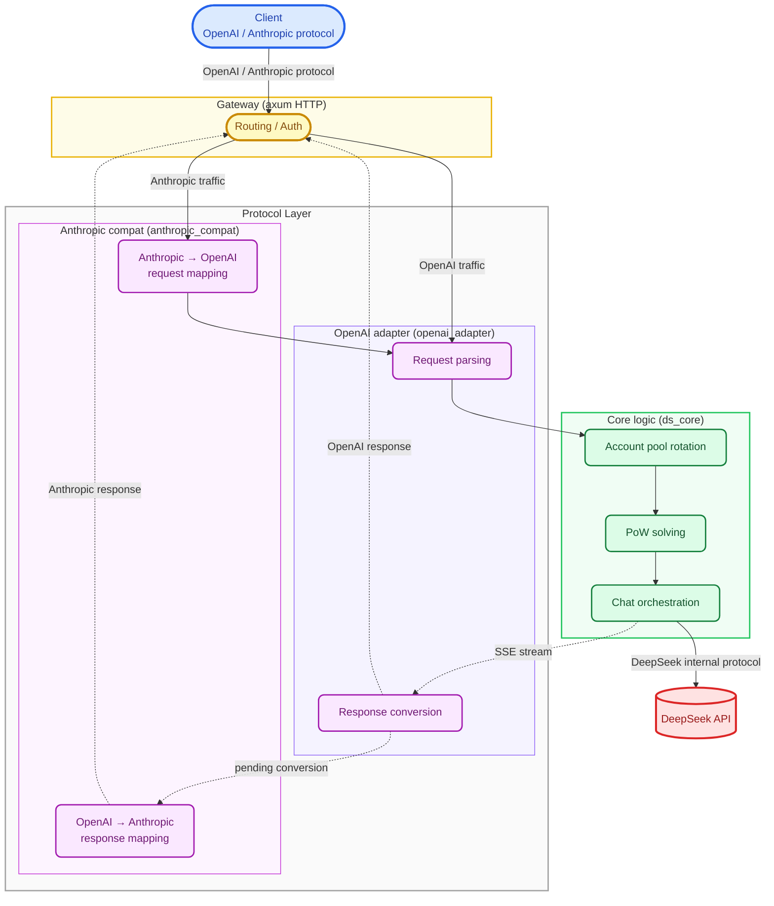

<p align="center">
  <svg xmlns="http://www.w3.org/2000/svg" viewBox="0 0 27 22" width="81" height="66">
    <path d="M26.5174 3.39471C26.235 3.2567 26.1137 3.52006 25.9487 3.65346C25.8923 3.69659 25.8446 3.75294 25.7969 3.80469C25.3846 4.24516 24.9027 4.53439 24.2737 4.49989C23.3536 4.44814 22.5682 4.73737 21.8735 5.44119C21.7258 4.57349 21.2353 4.0554 20.4889 3.72304C20.0985 3.55054 19.7034 3.37746 19.4297 3.00197C19.2388 2.73459 19.1865 2.43673 19.091 2.14289C19.0301 1.96579 18.9697 1.78466 18.7656 1.75418C18.5442 1.71968 18.4574 1.90541 18.3705 2.06067C18.0232 2.69549 17.8887 3.39471 17.9019 4.10313C17.9324 5.6965 18.6051 6.96556 19.9421 7.86834C20.0939 7.97184 20.133 8.07535 20.0852 8.22658C19.9938 8.53766 19.8857 8.83955 19.7903 9.15063C19.7293 9.34901 19.6385 9.39271 19.4257 9.30588C18.692 8.9994 18.0583 8.54571 17.4982 7.99772C16.5477 7.07827 15.6881 6.06336 14.6162 5.26869C14.3644 5.08296 14.1125 4.91045 13.8521 4.746C12.7584 3.68394 13.9952 2.81164 14.2816 2.70814C14.5812 2.60003 14.3857 2.22857 13.4179 2.23317C12.4502 2.2372 11.5646 2.56151 10.4359 2.99335C10.2708 3.05832 10.0972 3.10547 9.91951 3.14457C8.8954 2.95022 7.83162 2.90709 6.72069 3.03245C4.62877 3.26533 2.95777 4.25436 1.72954 5.94261C0.254043 7.97184 -0.0932679 10.2777 0.33167 12.6824C0.778458 15.2171 2.07225 17.3153 4.06008 18.9558C6.12152 20.6567 8.49577 21.4905 11.2047 21.3306C12.8498 21.2358 14.6812 21.0155 16.7473 19.2669C17.2682 19.5262 17.8151 19.6297 18.7219 19.7074C19.4205 19.7724 20.0933 19.6729 20.6143 19.5648C21.4302 19.3923 21.3739 18.6367 21.0789 18.4981C18.6874 17.3843 19.2124 17.8374 18.7351 17.4706C19.9501 16.033 21.8063 13.4776 22.379 9.99821C22.4353 9.61409 22.5072 9.073 22.4986 8.76192C22.494 8.57216 22.5377 8.49856 22.7545 8.47671C23.3536 8.40771 23.935 8.24383 24.4692 7.94999C26.0188 7.10357 26.6439 5.71318 26.7911 4.04678C26.8129 3.79204 26.7865 3.52869 26.5174 3.39471ZM13.0143 18.3946C10.6964 16.5724 9.5722 15.9726 9.10816 15.9985C8.67402 16.0244 8.75222 16.5212 8.84768 16.8449C8.94773 17.1646 9.07768 17.3849 9.25996 17.6655C9.38589 17.8512 9.47272 18.1272 9.13404 18.3348C8.38766 18.7965 7.08985 18.1796 7.0289 18.1491C5.51833 17.2595 4.25559 16.0853 3.36546 14.4793C2.50581 12.9337 2.0067 11.2753 1.92447 9.50542C1.90262 9.07818 2.02855 8.92695 2.45406 8.84932C3.01413 8.74582 3.59144 8.72397 4.15093 8.80619C6.51656 9.15178 8.53027 10.2092 10.2185 11.8848C11.1822 12.8388 11.9114 13.979 12.6623 15.0929C13.461 16.2757 14.3201 17.4027 15.4144 18.3268C15.8008 18.6505 16.109 18.8966 16.404 19.0783C15.5144 19.1778 14.0297 19.1991 13.0143 18.3958V18.3946ZM14.1252 11.2489C14.1252 11.0591 14.277 10.9079 14.4679 10.9079C14.511 10.9079 14.5501 10.9165 14.5852 10.9292C14.6329 10.9464 14.6766 10.9723 14.7111 11.0114C14.7721 11.0718 14.8066 11.158 14.8066 11.2489C14.8066 11.4386 14.6548 11.5899 14.4639 11.5899C14.273 11.5899 14.1252 11.4386 14.1252 11.2489ZM17.5759 13.0188C17.3545 13.1096 17.1331 13.1873 16.9203 13.1959C16.5903 13.2131 16.2303 13.0791 16.0348 12.9153C15.7312 12.6605 15.5139 12.5179 15.423 12.0734C15.3839 11.8837 15.4057 11.5899 15.4402 11.4214C15.5185 11.0585 15.4316 10.8257 15.1757 10.614C14.9676 10.4415 14.7025 10.3938 14.4115 10.3938C14.3029 10.3938 14.2034 10.3461 14.1292 10.3076C14.0079 10.2472 13.9078 10.096 14.0033 9.91023C14.0338 9.84985 14.1815 9.70322 14.216 9.67734C14.6111 9.45251 15.0665 9.52612 15.488 9.6946C15.8784 9.85445 16.174 10.1477 16.5989 10.5623C17.033 11.0631 17.1112 11.2011 17.3585 11.5772C17.554 11.871 17.7317 12.1729 17.8536 12.5185C17.9272 12.7341 17.8317 12.9107 17.5759 13.0188Z" fill="#ef4a00"/>
  </svg>
</p>

<h1 align="center">DS-Free-API</h1>

<p align="center">
  <a href="LICENSE"></a>
  
  
  
</p>
<p align="center">
  
  
  
  
</p>

[中文](README.md)

Reverse proxy and adapter for free DeepSeek web chat endpoints to standard OpenAI-compatible and Anthropic-compatible API protocols (currently supports chat completions and messages, including streaming and tool calls).

Cross-platform native Rust binary + single TOML config file.

## Quick Start

Download the release for your platform from [releases](https://github.com/NIyueeE/ds-free-api/releases) and extract.

```
  .
  ├── ds-free-api          # executable
  ├── LICENSE
  ├── README.md
  ├── README.en.md
  └── config.example.toml  # config template
```

### Configuration

Copy `config.example.toml` to `config.toml` in the same directory as the executable, or use `./ds-free-api -c <config_path>` to specify a config path.

### Run

```bash
# Run directly (requires config.toml in the same directory)
./ds-free-api

# Specify config path
./ds-free-api -c /path/to/config.toml

# Debug mode
RUST_LOG=debug ./ds-free-api
```

Required fields only. One account = one concurrency slot (seems max 2 concurrent).

```toml
[server]
host = "127.0.0.1"
port = 5317

# API access tokens, leave empty to disable auth
# [[server.api_tokens]]
# token = "sk-your-token"
# description = "dev test"

# Fill email or mobile (pick one or both). Mobile seems to only support +86 area.
[[accounts]]
email = "user1@example.com"
mobile = ""
area_code = ""
password = "pass1"
```

Here's a free test account — please don't send sensitive info through it (the program deletes sessions on cleanup, but leftovers may persist).

```text
rivigol378@tatefarm.com
test12345
```

If you want multiple accounts for concurrency, look into temporary email services (some may not work) and use a VPN to register on the international version.

Recommended temp-mail site: [temp-mail.org](https://temp-mail.org/en/10minutemail)

## API Endpoints

| Method | Path | Description |
|--------|------|-------------|
| GET | `/` | Health check |
| POST | `/v1/chat/completions` | Chat completions (streaming and tool calls supported) |
| GET | `/v1/models` | List models |
| GET | `/v1/models/{id}` | Get model |
| POST | `/anthropic/v1/messages` | Anthropic Messages API (streaming and tool calls supported) |
| GET | `/anthropic/v1/models` | List models (Anthropic format) |
| GET | `/anthropic/v1/models/{id}` | Get model (Anthropic format) |

## Model Mapping

`model_types` in `config.toml` (defaults to `["default", "expert"]`) maps automatically:

| OpenAI Model ID | DeepSeek Type |
|-----------------|---------------|
| `deepseek-default` | Default mode |
| `deepseek-expert` | Expert mode |

The Anthropic compatibility layer uses the same model IDs, accessed via `/anthropic/v1/messages`.

### Capability Toggles

- **Reasoning**: Enabled by default. To disable, add `"reasoning_effort": "none"` to the request body.
- **Web search**: Disabled by default. To enable, add `"web_search_options": {"search_context_size": "high"}`.
- **Tool calls**: Pass standard OpenAI `tools` and `tool_choice` fields. When the model decides to call a tool, the returned `finish_reason` will be `tool_calls`.

## Development

Requires Rust 1.95.0+ (see `rust-toolchain.toml`).

```bash
# One-pass check (check + clippy + fmt + audit + unused deps)
just check

# Run tests
cargo test

# Run HTTP server
just serve

# CLI examples
just ds-core-cli
just openai-adapter-cli

# Python e2e tests (requires server running on port 5317)
just e2e

# Start server with e2e test config
just e2e-serve
```

Architecture overview:



Data pipelines:

- **OpenAI request**: `JSON body` → `normalize` validation/defaults → `tools` extraction → `prompt` ChatML build → `resolver` model mapping → `ChatRequest`
- **OpenAI response**: `DeepSeek SSE bytes` → `sse_parser` → `state` patch state machine → `converter` format conversion → `tool_parser` XML parsing → `StopStream` truncation → `OpenAI SSE bytes`
- **Anthropic request**: `Anthropic JSON` → `to_openai_request()` → enters OpenAI request pipeline
- **Anthropic response**: OpenAI output → `from_chat_completion_stream()` / `from_chat_completion_bytes()` → `Anthropic SSE/JSON`

## License

[Apache License 2.0](LICENSE)

DeepSeek's official API is very affordable. Please support the official service.

This project was created to experiment with the latest models in DeepSeek's web A/B testing.

**Commercial use is strictly prohibited** to avoid putting pressure on official servers. Use at your own risk.
