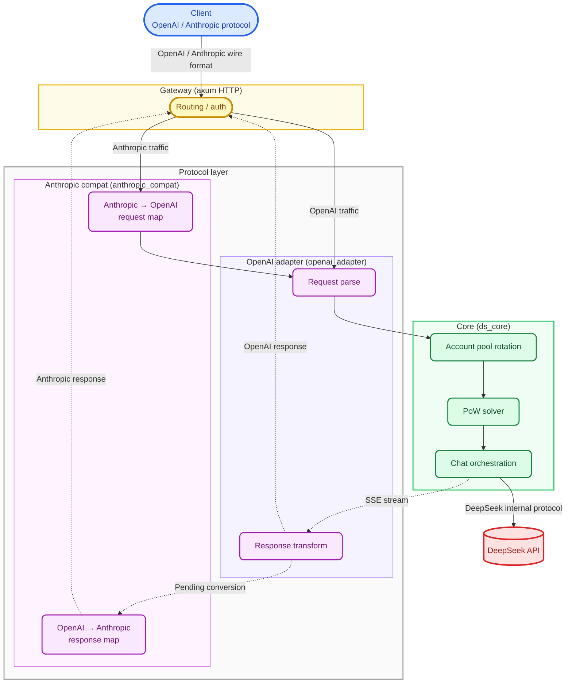

<p align="center">
  
</p>

<h1 align="center">DS-Free-API</h1>

<p align="center">
  <a href="LICENSE"></a>
  
  
  
</p>
<p align="center">
  
  
  
  
</p>


**Reverse proxy and adapter for free DeepSeek web chat to OpenAI and Anthropic APIs**

> Proxies DeepSeek's web endpoints and exposes them as streaming OpenAI-compatible chat completions (`/v1/chat/completions`) and Anthropic Messages (`/anthropic/v1/messages`), including tools—thin HTTP surface in front of DeepSeek's own web stack.

**Backed by** Rust, axum/Tokio, serde, and plain TOML—one static binary plus `config.toml`.

Cross-platform deploy: no Electron, no extra runtime beyond what you ship.

## Why

- **Grey-zone models on the web UI** — Exercise A/B variants and web-only features before they land in official API SKUs.
- **Zero marginal cost for experiments** — Use the free web tier when you are iterating, not paying per token.
- **Account pool rotation** — Spread load across multiple logins with bounded concurrency per account (DeepSeek still caps simultaneous sessions aggressively).

Treat this as a lab adapter, not a production entitlement to someone else's infra.

## Credits

Forked from **[llm-router/ds-free-api](https://github.com/NIyueeE/ds-free-api)** by **NIyueeE**. The original project reverse-engineered DeepSeek's web protocol and built the foundation this fork extends.

## This fork

- **`tools_present` compatibility** — Aligns streamed tool deltas with consumers that infer presence from SSE chunks rather than relying on a lone final envelope.
- **Reasoning merge** — Concatenates thought traces and assistant content without breaking clients that gate on canonical message ordering.
- **Anthropic compat layer** — First-class `/anthropic/v1/messages` mapping (bidirectional with the OpenAI pipeline) so Claude-shaped SDKs work without a second proxy.

## Quick start

Download a release for your platform from [releases](https://github.com/bkataru/ds-free-api/releases) and extract.

```
  .
  ├── ds-free-api          # binary
  ├── LICENSE
  ├── README.md
  ├── README.en.md
  └── config.example.toml  # sample config
```

Copy `config.example.toml` to `config.toml` next to the binary, or run `./ds-free-api -c /path/to/config.toml`.

```bash
# Run (expects config.toml beside the binary)
./ds-free-api

# Explicit config path
./ds-free-api -c /path/to/config.toml

# Verbose logging
RUST_LOG=debug ./ds-free-api
```

Required fields only. One account maps to one concurrency slot (DeepSeek appears to cap at about two concurrent sessions).

```toml
[server]
host = "127.0.0.1"
port = 5317

# API tokens; omit to disable auth
# [[server.api_tokens]]
# token = "sk-your-token"
# description = "dev test"

# Email and/or mobile (mobile currently looks +86-only)
[[accounts]]
email = "user1@example.com"
mobile = ""
area_code = ""
password = "pass1"
```

Shared throwaway logins for smoke tests—do not send secrets through them (sessions are torn down, yet leaks are still possible):

```text
rivigol378@tatefarm.com
test12345

counterfeit1341@wplacetools.com
test12345

idyllic4202@wplacetools.com
test12345

slowly1285@wplacetools.com
test12345
```

Need more throughput? Spin up extra accounts via disposable inboxes (not all domains work) and register on the international site with whatever network path you already use. [tempmail.la](https://tempmail.la/) is a decent starting point—try a few aliases if one bounces.

## API endpoints

| Method | Path | Description |
|--------|------|-------------|
| GET | `/` | Health check |
| POST | `/v1/chat/completions` | Chat completions (streaming + tools) |
| GET | `/v1/models` | Models list |
| GET | `/v1/models/{id}` | Model metadata |
| POST | `/anthropic/v1/messages` | Anthropic Messages (streaming + tools) |
| GET | `/anthropic/v1/models` | Models list (Anthropic shape) |
| GET | `/anthropic/v1/models/{id}` | Model metadata (Anthropic shape) |

## Model mapping

`model_types` inside `config.toml` (defaults to `["default", "expert"]`) maps automatically:

| OpenAI model ID | DeepSeek mode |
|-----------------|---------------|
| `deepseek-default` | Fast track |
| `deepseek-expert` | Expert track |

The Anthropic compatibility layer reuses the same IDs; call them through `/anthropic/v1/messages`.

### Capability switches

- **Reasoning traces** — On by default. Send `"reasoning_effort": "none"` to force plain answers.
- **Web search** — Off by default. Opt in with `"web_search_options": {"search_context_size": "high"}`.
- **Tool calls** — Standard OpenAI `tools` / `tool_choice`. When the model selects a tool, `finish_reason` becomes `tool_calls`.

## Architecture



Data paths:

- **OpenAI request** — `JSON body` → `normalize` (validation + defaults) → `tools` extraction → `prompt` ChatML assembly → `resolver` model mapping → `ChatRequest`.
- **OpenAI response** — `DeepSeek SSE bytes` → `sse_parser` → `state` patch machine → `converter` format pass → `tool_parser` XML extraction → `StopStream` truncation → `OpenAI SSE bytes`.
- **Anthropic request** — `Anthropic JSON` → `to_openai_request()` → joins the OpenAI request path.
- **Anthropic response** — OpenAI output → `from_chat_completion_stream()` / `from_chat_completion_bytes()` → `Anthropic SSE/JSON`.

## Commands

Requires Rust 1.95.0+ (`rust-toolchain.toml`).

```bash
# Lint + format + audit + unused deps
just check

# Unit tests
cargo test

# Local server
just serve

# CLI demos
just ds-core-cli
just openai-adapter-cli

# Python e2e (expects service on :5317)
just e2e

# Boot with the e2e profile
just e2e-serve
```

## License

[Apache License 2.0](LICENSE)

DeepSeek's official API is inexpensive—fund it when you graduate from web experiments.

**No commercial use.** Do not stress DeepSeek's web tier or treat this as a stealth production backend. You own the operational risk.
