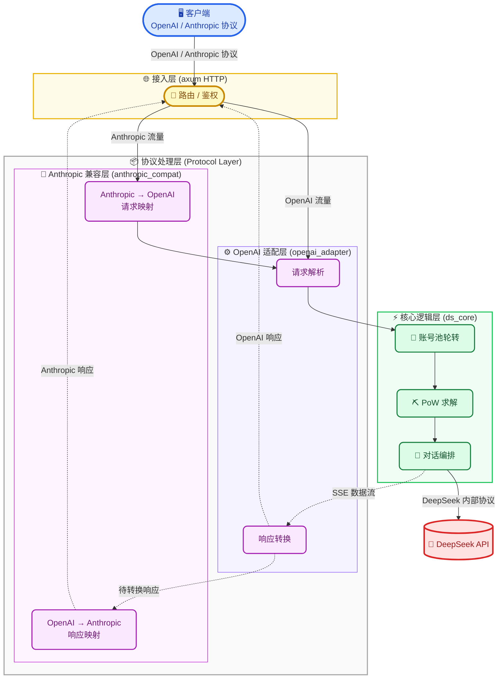

<p align="center">
  <img src="data:image/svg+xml;base64,PHN2ZyB4bWxucz0iaHR0cDovL3d3dy53My5vcmcvMjAwMC9zdmciIHZpZXdCb3g9IjAgMCAyNyAyMiIgd2lkdGg9IjgxIiBoZWlnaHQ9IjY2Ij48cGF0aCBkPSJNMjYuNTE3NCAzLjM5NDcxQzI2LjIzNSAzLjI1NjcgMjYuMTEzNyAzLjUyMDA2IDI1Ljk0ODcgMy42NTM0NkMyNS44OTIzIDMuNjk2NTkgMjUuODQ0NiAzLjc1Mjk0IDI1Ljc5NjkgMy44MDQ2OUMyNS4zODQ2IDQuMjQ1MTYgMjQuOTAyNyA0LjUzNDM5IDI0LjI3MzcgNC40OTk4OUMyMy4zNTM2IDQuNDQ4MTQgMjIuNTY4MiA0LjczNzM3IDIxLjg3MzUgNS40NDExOUMyMS43MjU4IDQuNTczNDkgMjEuMjM1MyA0LjA1NTQgMjAuNDg4OSAzLjcyMzA0QzIwLjA5ODUgMy41NTA1NCAxOS43MDM0IDMuMzc3NDYgMTkuNDI5NyAzLjAwMTk3QzE5LjIzODggMi43MzQ1OSAxOS4xODY1IDIuNDM2NzMgMTkuMDkxIDIuMTQyODlDMTkuMDMwMSAxLjk2NTc5IDE4Ljk2OTcgMS43ODQ2NiAxOC43NjU2IDEuNzU0MThDMTguNTQ0MiAxLjcxOTY4IDE4LjQ1NzQgMS45MDU0MSAxOC4zNzA1IDIuMDYwNjdDMTguMDIzMiAyLjY5NTQ5IDE3Ljg4ODcgMy4zOTQ3MSAxNy45MDE5IDQuMTAzMTNDMTcuOTMyNCA1LjY5NjUgMTguNjA1MSA2Ljk2NTU2IDE5Ljk0MjEgNy44NjgzNEMyMC4wOTM5IDcuOTcxODQgMjAuMTMzIDguMDc1MzUgMjAuMDg1MiA4LjIyNjU4QzE5Ljk5MzggOC41Mzc2NiAxOS44ODU3IDguODM5NTUgMTkuNzkwMyA5LjE1MDYzQzE5LjcyOTMgOS4zNDkwMSAxOS42Mzg1IDkuMzkyNzEgMTkuNDI1NyA5LjMwNTg4QzE4LjY5MiA4Ljk5OTQgMTguMDU4MyA4LjU0NTcxIDE3LjQ5ODIgNy45OTc3MkMxNi41NDc3IDcuMDc4MjcgMTUuNjg4MSA2LjA2MzM2IDE0LjYxNjIgNS4yNjg2OUMxNC4zNjQ0IDUuMDgyOTYgMTQuMTEyNSA0LjkxMDQ1IDEzLjg1MjEgNC43NDZDMTIuNzU4NCAzLjY4Mzk0IDEzLjk5NTIgMi44MTE2NCAxNC4yODE2IDIuNzA4MTRDMTQuNTgxMiAyLjYwMDAzIDE0LjM4NTcgMi4yMjg1NyAxMy40MTc5IDIuMjMzMTdDMTIuNDUwMiAyLjIzNzIgMTEuNTY0NiAyLjU2MTUxIDEwLjQzNTkgMi45OTMzNUMxMC4yNzA4IDMuMDU4MzIgMTAuMDk3MiAzLjEwNTQ3IDkuOTE5NTEgMy4xNDQ1N0M4Ljg5NTQgMi45NTAyMiA3LjgzMTYyIDIuOTA3MDkgNi43MjA2OSAzLjAzMjQ1QzQuNjI4NzcgMy4yNjUzMyAyLjk1Nzc3IDQuMjU0MzYgMS43Mjk1NCA1Ljk0MjYxQzAuMjU0MDQzIDcuOTcxODQgLTAuMDkzMjY3OSAxMC4yNzc3IDAuMzMxNjcgMTIuNjgyNEMwLjc3ODQ1OCAxNS4yMTcxIDIuMDcyMjUgMTcuMzE1MyA0LjA2MDA4IDE4Ljk1NThDNi4xMjE1MiAyMC42NTY3IDguNDk1NzcgMjEuNDkwNSAxMS4yMDQ3IDIxLjMzMDZDMTIuODQ5OCAyMS4yMzU4IDE0LjY4MTIgMjEuMDE1NSAxNi43NDczIDE5LjI2NjlDMTcuMjY4MiAxOS41MjYyIDE3LjgxNTEgMTkuNjI5NyAxOC43MjE5IDE5LjcwNzRDMTkuNDIwNSAxOS43NzI0IDIwLjA5MzMgMTkuNjcyOSAyMC42MTQzIDE5LjU2NDhDMjEuNDMwMiAxOS4zOTIzIDIxLjM3MzkgMTguNjM2NyAyMS4wNzg5IDE4LjQ5ODFDMTguNjg3NCAxNy4zODQzIDE5LjIxMjQgMTcuODM3NCAxOC43MzUxIDE3LjQ3MDZDMTkuOTUwMSAxNi4wMzMgMjEuODA2MyAxMy40Nzc2IDIyLjM3OSA5Ljk5ODIxQzIyLjQzNTMgOS42MTQwOSAyMi41MDcyIDkuMDczIDIyLjQ5ODYgOC43NjE5MkMyMi40OTQgOC41NzIxNiAyMi41Mzc3IDguNDk4NTYgMjIuNzU0NSA4LjQ3NjcxQzIzLjM1MzYgOC40MDc3MSAyMy45MzUgOC4yNDM4MyAyNC40NjkyIDcuOTQ5OTlDMjYuMDE4OCA3LjEwMzU3IDI2LjY0MzkgNS43MTMxOCAyNi43OTExIDQuMDQ2NzhDMjYuODEyOSAzLjc5MjA0IDI2Ljc4NjUgMy41Mjg2OSAyNi41MTc0IDMuMzk0NzFaTTEzLjAxNDMgMTguMzk0NkMxMC42OTY0IDE2LjU3MjQgOS41NzIyIDE1Ljk3MjYgOS4xMDgxNiAxNS45OTg1QzguNjc0MDIgMTYuMDI0NCA4Ljc1MjIyIDE2LjUyMTIgOC44NDc2OCAxNi44NDQ5QzguOTQ3NzMgMTcuMTY0NiA5LjA3NzY4IDE3LjM4NDkgOS4yNTk5NiAxNy42NjU1QzkuMzg1ODkgMTcuODUxMiA5LjQ3MjcyIDE4LjEyNzIgOS4xMzQwNCAxOC4zMzQ4QzguMzg3NjYgMTguNzk2NSA3LjA4OTg1IDE4LjE3OTYgNy4wMjg5IDE4LjE0OTFDNS41MTgzMyAxNy4yNTk1IDQuMjU1NTkgMTYuMDg1MyAzLjM2NTQ2IDE0LjQ3OTNDMi41MDU4MSAxMi45MzM3IDIuMDA2NyAxMS4yNzUzIDEuOTI0NDcgOS41MDU0MkMxLjkwMjYyIDkuMDc4MTggMi4wMjg1NSA4LjkyNjk1IDIuNDU0MDYgOC44NDkzMkMzLjAxNDEzIDguNzQ1ODIgMy41OTE0NCA4LjcyMzk3IDQuMTUwOTMgOC44MDYxOUM2LjUxNjU2IDkuMTUxNzggOC41MzAyNyAxMC4yMDkyIDEwLjIxODUgMTEuODg0OEMxMS4xODIyIDEyLjgzODggMTEuOTExNCAxMy45NzkgMTIuNjYyMyAxNS4wOTI5QzEzLjQ2MSAxNi4yNzU3IDE0LjMyMDEgMTcuNDAyNyAxNS40MTQ0IDE4LjMyNjhDMTUuODAwOCAxOC42NTA1IDE2LjEwOSAxOC44OTY2IDE2LjQwNCAxOS4wNzgzQzE1LjUxNDQgMTkuMTc3OCAxNC4wMjk3IDE5LjE5OTEgMTMuMDE0MyAxOC4zOTU4VjE4LjM5NDZaTTE0LjEyNTIgMTEuMjQ4OUMxNC4xMjUyIDExLjA1OTEgMTQuMjc3IDEwLjkwNzkgMTQuNDY3OSAxMC45MDc5QzE0LjUxMSAxMC45MDc5IDE0LjU1MDEgMTAuOTE2NSAxNC41ODUyIDEwLjkyOTJDMTQuNjMyOSAxMC45NDY0IDE0LjY3NjYgMTAuOTcyMyAxNC43MTExIDExLjAxMTRDMTQuNzcyMSAxMS4wNzE4IDE0LjgwNjYgMTEuMTU4IDE0LjgwNjYgMTEuMjQ4OUMxNC44MDY2IDExLjQzODYgMTQuNjU0OCAxMS41ODk5IDE0LjQ2MzkgMTEuNTg5OUMxNC4yNzMgMTEuNTg5OSAxNC4xMjUyIDExLjQzODYgMTQuMTI1MiAxMS4yNDg5Wk0xNy41NzU5IDEzLjAxODhDMTcuMzU0NSAxMy4xMDk2IDE3LjEzMzEgMTMuMTg3MyAxNi45MjAzIDEzLjE5NTlDMTYuNTkwMyAxMy4yMTMxIDE2LjIzMDMgMTMuMDc5MSAxNi4wMzQ4IDEyLjkxNTNDMTUuNzMxMiAxMi42NjA1IDE1LjUxMzkgMTIuNTE3OSAxNS40MjMgMTIuMDczNEMxNS4zODM5IDExLjg4MzcgMTUuNDA1NyAxMS41ODk5IDE1LjQ0MDIgMTEuNDIxNEMxNS41MTg1IDExLjA1ODUgMTUuNDMxNiAxMC44MjU3IDE1LjE3NTcgMTAuNjE0QzE0Ljk2NzYgMTAuNDQxNSAxNC43MDI1IDEwLjM5MzggMTQuNDExNSAxMC4zOTM4QzE0LjMwMjkgMTAuMzkzOCAxNC4yMDM0IDEwLjM0NjEgMTQuMTI5MiAxMC4zMDc2QzE0LjAwNzkgMTAuMjQ3MiAxMy45MDc4IDEwLjA5NiAxNC4wMDMzIDkuOTEwMjNDMTQuMDMzOCA5Ljg0OTg1IDE0LjE4MTUgOS43MDMyMiAxNC4yMTYgOS42NzczNEMxNC42MTExIDkuNDUyNTEgMTUuMDY2NSA5LjUyNjEyIDE1LjQ4OCA5LjY5NDZDMTUuODc4NCA5Ljg1NDQ1IDE2LjE3NCAxMC4xNDc3IDE2LjU5ODkgMTAuNTYyM0MxNy4wMzMgMTEuMDYzMSAxNy4xMTEyIDExLjIwMTEgMTcuMzU4NSAxMS41NzcyQzE3LjU1NCAxMS44NzEgMTcuNzMxNyAxMi4xNzI5IDE3Ljg1MzYgMTIuNTE4NUMxNy45MjcyIDEyLjczNDEgMTcuODMxNyAxMi45MTA3IDE3LjU3NTkgMTMuMDE4OFoiIGZpbGw9IiNlZjRhMDAiLz48L3N2Zz4=" width="81" height="66">
</p>

<h1 align="center">DS-Free-API</h1>

<p align="center">
  <a href="LICENSE"></a>
  
  
  
</p>
<p align="center">
  
  
  
  
</p>

[English](README.en.md)

将免费的 DeepSeek 网页端对话反代并适配转换为标准的 OpenAI API 协议 (目前支持 openai_chat_completions，包括流式返回与工具调用)。

支持 Rust 原生多端高性能，单可执行文件 + 单 TOML 配置文件。

## 快速开始

去 [releases](https://github.com/NIyueeE/ds-free-api/releases) 下载对应平台后解压即可。

```
  .
  ├── ds-free-api          # 可执行文件
  ├── LICENSE
  ├── README.md
  ├── README.en.md
  └── config.example.toml  # 配置示例
```

### 配置

复制 `config.example.toml` 为 `config.toml`，和可执行文件保持在同一个路径下，或者使用 `./ds-free-api -c <config_path>` 指定配置路径。

### 运行

```bash
# 直接运行 (同目录下需要 config.toml)
./ds-free-api

# 指定配置路径
./ds-free-api -c /path/to/config.toml

# 调试模式
RUST_LOG=debug ./ds-free-api
```

这里只展示必填项。一个账号对应一个并发量（但 DeepSeek 好像最多限制二个并发）。

```toml
[server]
host = "127.0.0.1"
port = 5317

# API 访问令牌，留空则不鉴权
# [[server.api_tokens]]
# token = "sk-your-token"
# description = "开发测试"

# 邮箱和手机号二选一或都填，手机号目前好像只支持 +86
[[accounts]]
email = "user1@example.com"
mobile = ""
area_code = ""
password = "pass1"
```

这里分享一个免费的测试账号，不要发敏感信息（虽然程序每次会收尾删除会话，但是可能会遗留）。

```text
rivigol378@tatefarm.com
test12345
```

想要自己多整几个账号并发的话，可以研究一下临时邮箱（有些可能不行），然后加魔法在国际版中多注册几个账号。

推荐临时邮箱网站：[temp-mail.org](https://temp-mail.org/en/10minutemail)

## API 端点

| 方法 | 路径 | 说明 |
|------|------|------|
| GET | `/` | 健康检查 |
| POST | `/v1/chat/completions` | 聊天补全（支持流式与工具调用） |
| GET | `/v1/models` | 模型列表 |
| GET | `/v1/models/{id}` | 模型详情 |
| POST | `/anthropic/v1/messages` | Anthropic Messages API（支持流式与工具调用） |
| GET | `/anthropic/v1/models` | 模型列表（Anthropic 格式） |
| GET | `/anthropic/v1/models/{id}` | 模型详情（Anthropic 格式） |

## 模型映射

`config.toml` 中 `model_types`（默认 `["default", "expert"]`）自动映射：

| OpenAI 模型 ID | DeepSeek 类型 |
|----------------|--------------|
| `deepseek-default` | 快速模式 |
| `deepseek-expert` | 专家模式 |

Anthropic 兼容层使用相同的模型 ID，通过 `/anthropic/v1/messages` 调用。

### 能力开关

- **深度思考**：默认已开启。如需显式关闭，请求体中加 `"reasoning_effort": "none"`。
- **智能搜索**：默认关闭。如需开启，请求体中加 `"web_search_options": {"search_context_size": "high"}`。
- **工具调用**：按 OpenAI 标准传入 `tools` 与 `tool_choice` 即可。当模型决定调用工具时，返回的 `finish_reason` 为 `tool_calls`。

## 开发

需要 Rust 1.95.0+（见 `rust-toolchain.toml`）。

```bash
# 一键检查 (check + clippy + fmt + audit + unused deps)
just check

# 运行测试
cargo test

# 运行 HTTP 服务
just serve

# CLI 示例
just ds-core-cli
just openai-adapter-cli

# Python e2e 测试（需要服务已在 5317 端口运行）
just e2e

# 使用 e2e 专属配置启动服务
just e2e-serve
```

简要架构图：



数据管道：

- **OpenAI 请求**: `JSON body` → `normalize` 校验/默认值 → `tools` 提取 → `prompt` ChatML 构建 → `resolver` 模型映射 → `ChatRequest`
- **OpenAI 响应**: `DeepSeek SSE bytes` → `sse_parser` → `state` 补丁状态机 → `converter` 格式转换 → `tool_parser` XML 解析 → `StopStream` 截断 → `OpenAI SSE bytes`
- **Anthropic 请求**: `Anthropic JSON` → `to_openai_request()` → 进入 OpenAI 请求管道
- **Anthropic 响应**: OpenAI 输出 → `from_chat_completion_stream()` / `from_chat_completion_bytes()` → `Anthropic SSE/JSON`

## 许可证

[Apache License 2.0](LICENSE)

DeepSeek 官方 API 非常便宜，请大家多多支持官方服务。

本项目的初心是想体验官方网页端灰度测试的最新模型。

**严禁商用**，避免对官方服务器造成压力，否则风险自担。
